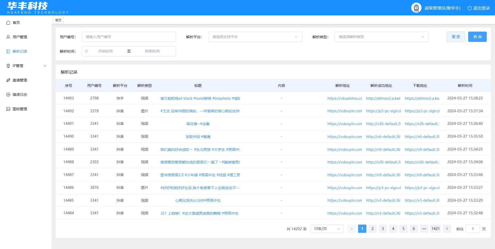

<!--
 * @Author: 敬华丰 2637844016@qq.com
 * @Date: 2024-03-27 15:39:04
 * @LastEditors: 敬华丰 2637844016@qq.com
 * @LastEditTime: 2024-03-27 16:02:20
 * @FilePath: \华丰去水印Git收费模式\README.md
 * @Description: 这是默认设置,请设置`customMade`, 打开koroFileHeader查看配置 进行设置: https://github.com/OBKoro1/koro1FileHeader/wiki/%E9%85%8D%E7%BD%AE
-->

## 项目简介

短视频聚合去水印小程序是一个旨在实现用户看广告得收益（可二开）。该小程序接入了小程序流量主功能，用户通过观看广告视频来获取收益。同时，该小程序支持抖音、快手、小红书、哔哩哔哩、西瓜视频、微博、今日头条、YouTuBe、TikTok等全网短视频平台的聚合，用户可以在小程序中浏览和分享这些短视频。

## 技术栈

- 前端使用Uniapp + uview框架进行开发，实现小程序的跨平台兼容性。
- 管理端使用Vue3和Element Plus进行开发，提供了对小程序内容和用户数据的管理功能。
- 后端使用Java和MySql进行开发，处理小程序的后台逻辑和数据存储。

## 小程序体验

您可以点击下方的图片体验短视频聚合去水印小程序：

## 管理后台体验

您可以点击下方的图片查看管理后台：

## 联系作者

您可以点击下方的图片联系作者：

